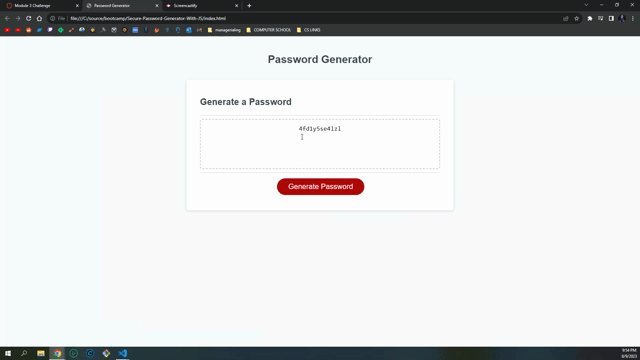

# Secure-Password-Generator-With-JS

## Simply generate a random password using window prompts! 

here's the link: 

After our first week of JavaScript, we were introduced to several different concepts such as iteration, functions, methods, objects, the concept of scope, and many other core ideas driving the language. Using these foundational pieces of Javascript, we created a random password generator. 

We used four different character sets: uppercase letters, lowercase letters, numbers, and special characters. By using window prompts and if statements, the user is able to select which of these four character sets they would like to use in their randomly generated password that is between 8 and 128 characters. Finally with iteration and random indexing, characters were selected from the users chosen characters. 

Credit to my tutor this week, Anthony Parrino, for helping me with the scope of my functions and for helping me debug my code! It originally wasn't running due to the fact that my writePassword function was inside the scope of the generatePassword function. Also helped me with my iterative for loop at the end. 

Thanks for reading!  